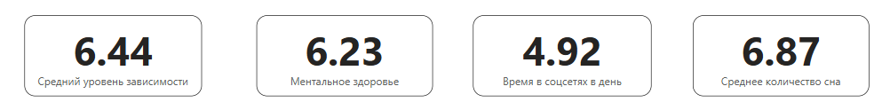
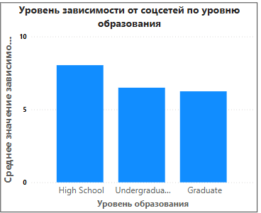
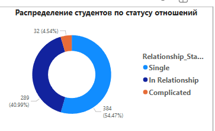
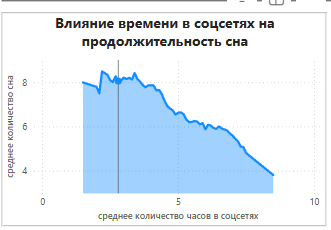
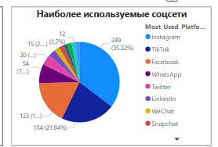
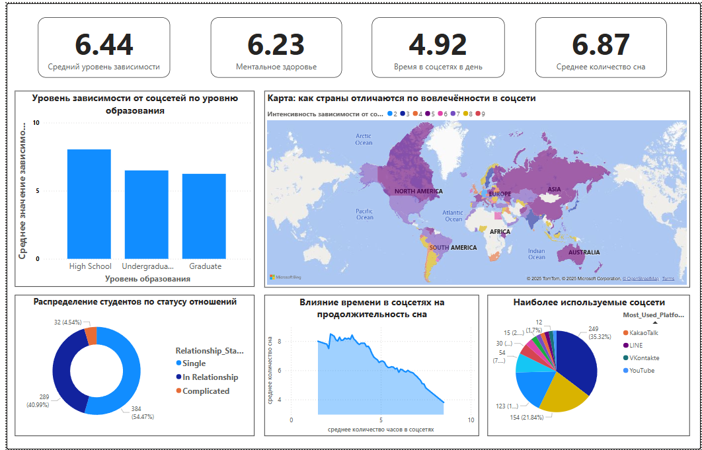

# Student-social-media-report
Этот проект представляет собой визуальный дашборд в Power BI, отображающий влияние социальных сетей на поведение студентов, ментальное здоровье и продолжительность сна.

### KPI Summary Cards

- **Средний уровень зависимости:** 6.44
- **Ментальное здоровье:** 6.23
- **Время в соцсетях в день:** 4.92 часов
- **Средняя продолжительность сна:** 6.87 часов

Карточки показывают ключевые метрики и дают общее представление о поведении студентов.

###  Уровень зависимости от соцсетей по уровню образования

- Старшеклассники показывают наибольшую зависимость.
- Уровень зависимости снижается с ростом уровня образования.

###  Карта вовлеченности по странам

- Фиолетовые регионы — высокая вовлеченность.
- Светлые регионы — низкая активность.

###  Распределение по статусу отношений

- Single: 54.47%
- In Relationship: 40.99%
- Complicated: 4.54%

  ###  Влияние времени в соцсетях на сон

- По оси X — часы в соцсетях.
- По оси Y — продолжительность сна.

###  Наиболее используемые платформы

- Instagram — 35.22%
- TikTok — 21.84%### 📱 Наиболее используемые платформы
 

  ### 🧩 Полный дашборд Power BI

Объединяет все визуализации в одной панели. Социальные сети напрямую влияют на продолжительность сна. Молодёжь, особенно школьники, более подвержены цифровой зависимости. Географический фактор влияет на уровень вовлечённости.  Instagram и TikTok ключевые платформы воздействия на студентов.
